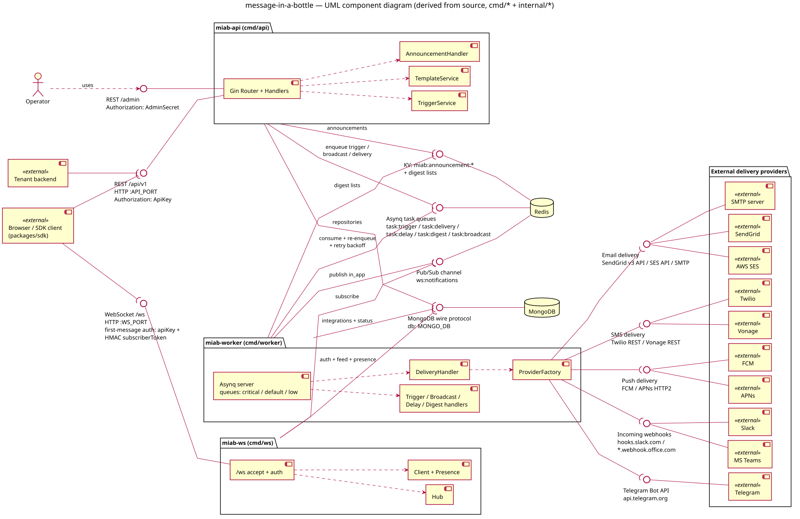

# message-in-a-bottle — UML component diagram

Source: [message-in-a-bottle-component-diagram.puml](./message-in-a-bottle-component-diagram.puml). Every relation below was derived from
the Go source (not from READMEs or the `*.partiri.jsonc` deploy configs) and verified at the cited
`file:line`.

For readability the diagram attaches Redis/MongoDB required interfaces at the deployable level
(miab-api / miab-ws / miab-worker); the table below breaks each of those edges down to the exact
sub-component that owns it.

## Runtime components

| Component | Entry point | Role |
|---|---|---|
| miab-api | `cmd/api/main.go` | Gin HTTP server on `:API_PORT` (default 3000): REST `/api/v1` (ApiKey auth), `/admin` (AdminSecret auth), `GET /health`, public `GET /api/v1/announcements/active` |
| miab-ws | `cmd/ws/main.go` | HTTP server on `:WS_PORT` (default 3001): `GET /health` and WebSocket `/ws` with first-message auth (apiKey + HMAC subscriberToken) |
| miab-worker | `cmd/worker/main.go` | Asynq consumer (queues `critical`/`default`/`low`); no HTTP listener |
| MongoDB | external datastore | `MONGO_URI`, db `MONGO_DB` (`internal/config/config.go:46-47`) |
| Redis | external datastore | Three distinct roles: Asynq task-queue broker, pub/sub channel `ws:notifications`, plain KV (`miab:announcement:*` keys, digest lists) |
| External delivery providers | — | SendGrid, AWS SES, SMTP, Twilio, Vonage, FCM, APNs, Slack incoming webhooks, MS Teams webhooks, Telegram Bot API (`internal/provider/factory.go:54-68`) |
| Clients | — | Tenant backend (REST), browser/SDK client (`packages/sdk` — REST + WS), operator (`/admin`) |

## Connections / interfaces

| # | From | To (interface) | Protocol / contract | Citation |
|---|---|---|---|---|
| 1 | Tenant backend, SDK client | miab-api `REST /api/v1` | HTTP, `Authorization: ApiKey <key>` (SHA-256 hash lookup), per-key permissions | `internal/handler/router.go:39-135`, `internal/middleware/auth.go:30-52`, `packages/sdk/src/http.ts` |
| 2 | Operator | miab-api `REST /admin` | HTTP, `Authorization: AdminSecret <secret>` | `internal/handler/router.go:27-37`, `internal/middleware/admin.go:13-26` |
| 3 | SDK client | miab-ws `WebSocket /ws` | WS; auth via first JSON message `{apiKey, subscriberToken, subscriberId}` within 10 s; HMAC token validated with `SUBSCRIBER_HMAC_SECRET` | `cmd/ws/main.go:96-175`, `internal/middleware/subscriber_scope.go:33-67`, `packages/sdk/src/ws.ts:37` |
| 4 | miab-api | MongoDB | Mongo driver; 10 repositories (env, subscriber, topic, topic-subscriber, workflow, integration, template, preference, notification, activity) + index bootstrap | `cmd/api/main.go:38-53,70-79` |
| 5 | miab-api (TriggerService) | Redis (Asynq queues) | enqueue `task:trigger`, `task:broadcast`; notifications persisted to Mongo first | `internal/service/trigger_service.go:97,122-123,151-152`, client at `cmd/api/main.go:63-66` |
| 6 | miab-api (TemplateService) | Redis (Asynq queues) | enqueue `task:delivery` for transactional template sends | `internal/service/template_service.go:108-109` |
| 7 | miab-api (AnnouncementHandler) | Redis (KV) | `SET`/`GET`/`SCAN`/`MGET`/`DEL` on `miab:announcement:*` with TTL = expiresAt | `internal/handler/announcement_handler.go:56,109,172,187-198` |
| 8 | miab-worker (Asynq server) | Redis (Asynq queues) | consume `task:trigger/delivery/delay/digest/broadcast`, concurrency 10, queues critical:6/default:3/low:1 | `cmd/worker/main.go:85-105` |
| 9 | miab-worker (flow handlers) | Redis (Asynq queues) | re-enqueue: trigger→delivery/delay/digest, broadcast→trigger, delay/digest→following deliveries | `internal/worker/trigger_handler.go:174-175,198-199,243-244`, `internal/worker/broadcast_handler.go:122-123`, `internal/worker/tasks.go:129` |
| 10 | miab-worker (DeliveryHandler) | Redis (Asynq queues) | retry enqueue with exponential backoff (max 3, base 30 s, x4) | `internal/worker/delivery_handler.go:315-316`, `internal/worker/tasks.go:19-21` |
| 11 | miab-worker | MongoDB | workflows, subscribers, integrations, notifications (channel status), activity log, preferences, rate-limit counters | `cmd/worker/main.go:34-49,66-72` |
| 12 | miab-worker (DeliveryHandler) | Redis (pub/sub `ws:notifications`) | PUBLISH `notification:new` + `unseen count` events for `in_app` channel, room `env:<id>:sub:<id>` | `internal/worker/delivery_handler.go:502-528` |
| 13 | miab-worker (trigger/digest handlers) | Redis (KV digest lists) | `RPUSH`/`EXPIRE` notification IDs per digest key; `LRANGE`/`DEL` when digest fires | `internal/worker/trigger_handler.go:219-229`, `internal/worker/digest_handler.go:45-49` |
| 14 | miab-ws (Hub) | Redis (pub/sub `ws:notifications`) | SUBSCRIBE; fan-out to connected clients by room | `internal/ws/hub.go:59-86`, wired at `cmd/ws/main.go:70-71` |
| 15 | miab-ws | MongoDB | API-key/env lookup, subscriber lookup, presence writes, feed read, mark seen/read/archive, unseen count | `cmd/ws/main.go:45-67,127,158`, `internal/ws/client.go:62,119-181`, `internal/ws/presence.go:19` |
| 16 | miab-worker (ProviderFactory) | SendGrid | sendgrid-go SDK (HTTPS v3 API) | `internal/provider/sendgrid.go:33-34` |
| 17 | miab-worker (ProviderFactory) | AWS SES | aws-sdk-go-v2 `ses` client, static creds | `internal/provider/ses.go:31-45` |
| 18 | miab-worker (ProviderFactory) | SMTP server | `net/smtp` PLAIN auth to tenant-configured host:port | `internal/provider/smtp.go:30-43` |
| 19 | miab-worker (ProviderFactory) | Twilio | POST `https://api.twilio.com/2010-04-01/Accounts/<sid>/Messages.json` | `internal/provider/twilio.go:31-38` |
| 20 | miab-worker (ProviderFactory) | Vonage | POST `https://rest.nexmo.com/sms/json` | `internal/provider/vonage.go:38` |
| 21 | miab-worker (ProviderFactory) | FCM | firebase-admin-go SDK, service-account JSON | `internal/provider/fcm.go:30-56` |
| 22 | miab-worker (ProviderFactory) | APNs | apns2 SDK, token auth (HTTP/2) | `internal/provider/apns.go:29-40` |
| 23 | miab-worker (ProviderFactory) | Slack | POST to subscriber-supplied incoming-webhook URL; SSRF-guarded allowlist `hooks.slack.com` | `internal/provider/slack.go:23-34`, `internal/provider/safehttp.go:20-26` |
| 24 | miab-worker (ProviderFactory) | MS Teams | POST to subscriber-supplied webhook URL; allowlist `*.webhook.office.com` | `internal/provider/msteams.go:23-44`, `internal/provider/safehttp.go:20-26` |
| 25 | miab-worker (ProviderFactory) | Telegram | POST `https://api.telegram.org/bot<token>/sendMessage`; bot token from encrypted integration credentials, chat ID from `channels.telegram.chatId`; token redacted from errors | `internal/provider/telegram.go:73-124`, `internal/provider/factory.go:67` |

Interfaces folded out of the picture for legibility (still real, in code):

| Interface | Provider | Citation |
|---|---|---|
| `GET /health` on miab-api | Gin router | `cmd/api/main.go:112-114` |
| `GET /health` on miab-ws | mux | `cmd/ws/main.go:90-94` |
| Public (unauthenticated) `GET /api/v1/announcements/active` | miab-api | `internal/handler/router.go:24` |
| WS client actions `seen/read/archive/fetch` over the established socket (write back to Mongo) | miab-ws Client | `internal/ws/client.go:113-178`, `internal/ws/messages.go` |
| `log` provider (no external system — writes to stdout) | ProviderFactory | `internal/provider/factory.go:55-57` |

## Relations easy to draw wrong (corrected)

- **The API never publishes to `ws:notifications`** — only the worker's DeliveryHandler does (`internal/worker/delivery_handler.go:515,528`); the only publisher/subscriber pair is worker→ws.
- **miab-ws never enqueues Asynq tasks** — no asynq import anywhere in `cmd/ws` or `internal/ws`; WS client actions (seen/read/archive) write straight to Mongo (`internal/ws/client.go:119-147`).
- **API, WS, and worker never talk to each other directly** — no HTTP client between them; all coupling is through Redis (queue + pub/sub) and MongoDB.
- **Presence is Mongo, not Redis** — online/offline status is written via `SubscriberRepository.SetOnlineStatus` (`internal/ws/presence.go:19`, `internal/ws/client.go:62`), not Redis keys.
- **The worker has no HTTP listener** — no `http.Server`/mux in `cmd/worker`; its only inbound interface is the Asynq queue.
- **The API's Redis client (non-Asynq) is used solely by AnnouncementHandler** — it is injected only there (`cmd/api/main.go:96`).
- **`in_app` and `push` bypass the single-primary-integration path** — `in_app` goes to Redis pub/sub with no provider (`internal/worker/delivery_handler.go:138-139`), and `push` fans out to both FCM and APNs integrations per token (`internal/worker/delivery_handler.go:371-451`).
- **Rate limiting is Mongo-backed, not Redis** — `RateLimitRepository.IncrementAndCheck` (`internal/worker/delivery_handler.go:117`).

## README ↔ code discrepancies

None affecting the component model: the service set (api, ws, worker + Mongo + Redis) and the Redis pub/sub channel described in the docs match the code.
